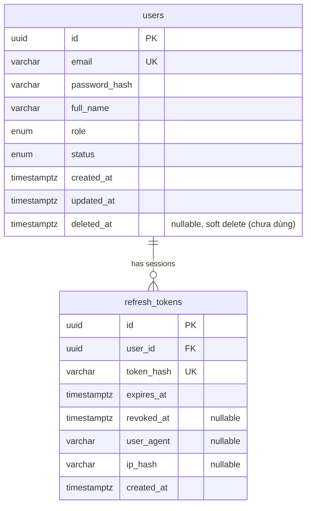
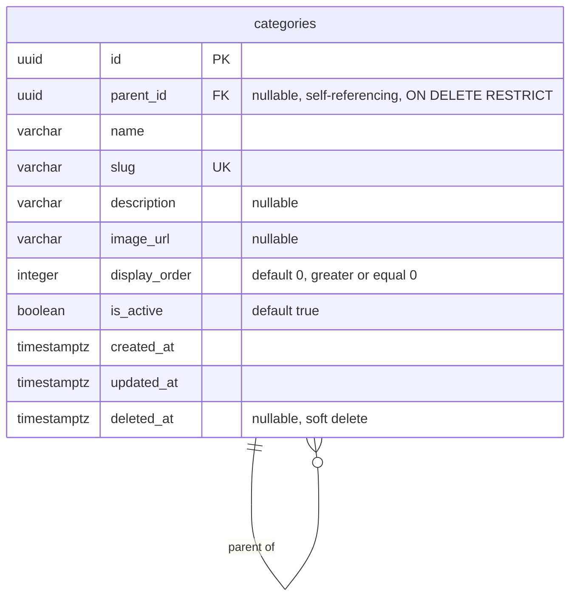

# Database Design — Core Entities (User, Auth, Category)

Tài liệu này mô tả business requirements và thiết kế database thực tế của
các module **User**, **Auth** (`backend/src/modules/users`,
`backend/src/modules/auth`) và **Category**
(`backend/src/modules/categories`) trong backend. Nội dung được tái dựng từ
mã nguồn, migration và test hiện có — không phải từ giáo trình. Chỗ nào
không suy ra được từ code/test sẽ được ghi rõ là **chưa xác định**.

## 1. Phạm vi

Các phần đã triển khai và tài liệu hoá trong file này chịu trách nhiệm:

- Lưu trữ tài khoản người dùng (`users`).
- Xác thực bằng email/password (argon2) và cấp JWT access token.
- Quản lý refresh token dạng session xoay vòng (rotation) với phát hiện
  tái sử dụng (reuse detection), lưu ở bảng `refresh_tokens`.
- Tổ chức sản phẩm theo cây danh mục nhiều cấp (`categories`) — xem mục 14.

Ngoài phạm vi (thuộc các bài/module khác, **chưa triển khai**, không đụng
tới ở đây): Address (**lưu ý:** chưa có migration/module Address nào trong
repository tại thời điểm viết tài liệu này, dù có thể được đề cập là "đã xử
lý" ở nơi khác — xem mục J của báo cáo Bài 23), Brand, Product,
ProductImage, ProductVariant, Inventory, Coupon, Cart, Order, Payment,
Shipment, Review, Search, Elasticsearch, Supabase Storage, PayOS,
CategoryTranslation, Locale.

## 2. Actor và quyền hạn

| Actor | Quyền hạn liên quan đến Auth |
| --- | --- |
| Khách vãng lai (chưa đăng nhập) | Gọi `POST /auth/register`, `POST /auth/login`, `POST /auth/refresh`, `POST /auth/logout` (các route đánh dấu `@Public()`) |
| `CUSTOMER` (mặc định sau khi đăng ký) | Gọi `GET /auth/me`; các route yêu cầu JWT hợp lệ |
| `ADMIN` | Giống `CUSTOMER` về Auth; phân quyền theo `role` cho các resource khác dùng `RolesGuard` + `@Roles()` (chưa có route nào dùng ở phạm vi Auth hiện tại) |

`UserRole` chỉ có hai giá trị: `CUSTOMER`, `ADMIN`
(`src/common/enums/user-role.enum.ts`). Tài khoản `ADMIN` **chỉ** được tạo
qua seed script (`pnpm seed:admin`, đọc `SEED_ADMIN_EMAIL/PASSWORD/FULL_NAME`
từ env) — endpoint đăng ký công khai (`POST /auth/register`) luôn gán cứng
`role: CUSTOMER` ở `AuthService.register()`, không nhận `role` từ body
request (`RegisterDto` không có trường `role`). Đây là invariant bắt buộc:
**role không bao giờ được nhận trực tiếp từ input đăng ký công khai**.

## 3. Luồng đăng ký (`POST /auth/register`)

1. `RegisterDto` validate `email` (định dạng email, tối đa 255 ký tự),
   `password` (8–128 ký tự), `fullName` (2–255 ký tự).
2. `AuthService.register()` chuẩn hoá email bằng `email.toLowerCase()`.
3. Kiểm tra tồn tại qua `UsersService.findByEmail(normalizedEmail)`. Nếu đã
   tồn tại → `409 Conflict` với `code: EMAIL_ALREADY_EXISTS`.
4. Hash password bằng `argon2.hash()` (argon2id, tham số mặc định của thư
   viện `argon2`). **Không bao giờ lưu password dạng plaintext.**
5. Tạo `UserEntity` với `role: CUSTOMER`, `status: ACTIVE` mặc định.
6. Response (`UserResponseDto`) chỉ trả `id, email, fullName, role, status`
   — không bao giờ trả `passwordHash`.

Rate limit: `@Throttle({ default: { limit: 5, ttl: 60_000 } })` (5 lần/phút
theo IP, qua `ThrottlerGuard` toàn cục + Redis storage).

## 4. Luồng đăng nhập (`POST /auth/login`)

1. `AuthService.validateCredentials(email, password)`:
   - Tìm user theo email đã lowercase.
   - Nếu không tồn tại: vẫn chạy `argon2.hash()` trên một chuỗi ngẫu nhiên
     (`simulatePasswordVerification`) trước khi trả `401 INVALID_CREDENTIALS`
     — chống timing attack dò email tồn tại hay không.
   - Nếu tồn tại nhưng sai password: `401 INVALID_CREDENTIALS` (thông điệp
     giống hệt trường hợp không tồn tại — không lộ email có tồn tại).
   - Nếu đúng password nhưng `status !== ACTIVE`: `403 ACCOUNT_NOT_ACTIVE`.
2. `AuthService.login()`: ký access token JWT (`signAccessToken`, secret
   `JWT_ACCESS_SECRET`, hạn `JWT_ACCESS_EXPIRES_IN`) và phát hành refresh
   token mới (`issueRefreshToken`).
3. Access token trả trong response body (`AuthResponseDto.accessToken`).
   Refresh token (raw, chưa hash) chỉ được đặt vào cookie `httpOnly`,
   `sameSite=lax`, `secure` theo `COOKIE_SECURE` — **không bao giờ xuất hiện
   trong response body**.

Rate limit: 10 lần/phút theo IP.

## 5. Vòng đời refresh session & rotation (`POST /auth/refresh`)

Mỗi lần đăng nhập/refresh thành công tạo **một session mới** (một dòng
`refresh_tokens`), không tái sử dụng dòng cũ:

1. Token thô (64 byte ngẫu nhiên từ `crypto.randomBytes`, hex-encode) chỉ
   tồn tại phía client (cookie). Server chỉ lưu
   `sha256(rawToken)` (`tokenHash`, cột `token_hash`, unique).
   **Không lưu refresh token thô trong database.**
2. `POST /auth/refresh`:
   - Tìm session theo `tokenHash` (kèm `relations: { user: true }`).
   - Nếu không tồn tại, đã `revokedAt`, hoặc đã hết hạn (`expiresAt < now`):
     - Nếu session tồn tại và **chưa** bị revoke tại thời điểm đọc (tức là
       hết hạn nhưng chưa ai revoke) → coi là dấu hiệu bất thường, revoke
       **toàn bộ session còn hoạt động của user đó** (`revokeAllForUser`).
     - Trả `401 INVALID_REFRESH_TOKEN`.
   - Nếu user liên kết không còn `ACTIVE` → revoke session này, trả `401`.
   - Ngược lại: revoke session hiện tại một cách **có điều kiện**
     (`UPDATE ... WHERE id = :id AND revoked_at IS NULL`), dùng số dòng bị
     ảnh hưởng (`UpdateResult.affected`) làm bằng chứng "mình là request đầu
     tiên revoke session này":
     - Nếu `affected === 0` (một request khác đã revoke trước, tức là
       cùng một refresh token bị dùng đồng thời) → coi là **reuse**, revoke
       toàn bộ session của user, trả `401 INVALID_REFRESH_TOKEN`.
     - Nếu `affected > 0` → phát access token mới + refresh token mới
       (session mới), trả về `200`.

Cơ chế trên đảm bảo **rotate là nguyên tử ở mức row**: hai request đồng
thời dùng chung một refresh token thô chỉ có **đúng một** request thắng
(`200`), request còn lại nhận `401` — dựa vào tính nguyên tử của một câu
UPDATE điều kiện trong PostgreSQL (không cần transaction/khoá tường minh).
Được kiểm chứng bằng test e2e
`allows only one winner when the same refresh token is used concurrently`
(`backend/test/auth.e2e-spec.ts`).

**Giới hạn còn lại (chưa xử lý, xem mục 11):** giữa bước "revoke session
thua cuộc" và bước "request thắng cuộc tạo dòng session mới", nếu request
thua thực thi `revokeAllForUser` *trước khi* dòng mới của request thắng
được insert xong, dòng mới đó sẽ không bị cuốn vào revoke-all. Cửa sổ race
này rất hẹp (vài mili-giây, cùng một request handler) và không phá vỡ bất
biến chính (không có hai lần rotate thành công từ một token), nhưng chưa
được loại bỏ hoàn toàn bằng transaction/khoá tường minh.

## 6. Đăng xuất (`POST /auth/logout`)

Lấy refresh token thô từ cookie, hash, tìm session, revoke nếu còn active
(idempotent — gọi nhiều lần không lỗi). Luôn xoá cookie phía client dù có
token hay không.

**Đăng xuất "tất cả thiết bị" hiện tại là một hệ quả của reuse detection**
(`revokeAllForUser` được gọi tự động khi phát hiện refresh token bị dùng
lại), **không phải một endpoint công khai riêng** (không có
`POST /auth/logout-all` hay tương đương). Nếu có yêu cầu nghiệp vụ cho
người dùng chủ động "đăng xuất mọi thiết bị" từ một thiết bị đang đăng
nhập, đây là **tính năng chưa xác định/chưa triển khai** — không suy ra
được từ code hay test hiện tại.

## 7. Quy tắc khoá/vô hiệu hoá tài khoản

`UserStatus`: `ACTIVE`, `INACTIVE`, `BLOCKED`
(`src/common/enums/user-status.enum.ts`). Không có API nào trong phạm vi
Auth hiện tại để đổi status (chưa có endpoint admin quản lý user) — đây là
**chưa triển khai**, có thể thuộc phạm vi module Users/Admin sau này.

Khi user không còn `ACTIVE`:

- Đăng nhập bị chặn ngay ở bước `validateCredentials` (`403`).
- `JwtStrategy.validate()` chặn luôn access token của user không còn
  `ACTIVE` (kiểm tra lại DB mỗi request, không chỉ tin JWT payload).
- `AuthService.refresh()` chặn và revoke session nếu user không còn
  `ACTIVE`.

Không có cơ chế xoá cứng (`hard delete`) user trong code hiện tại.
`UserEntity` có `@DeleteDateColumn` (soft delete) nhưng **chưa có API nào
gọi `softRemove`/`softDelete`** — cột `deleted_at` tồn tại ở schema nhưng
chưa được nghiệp vụ nào sử dụng. Vì `refresh_tokens.user_id` có
`ON DELETE CASCADE`, nếu user bị xoá cứng thì toàn bộ refresh token của
user đó bị xoá theo — không tạo orphan session. Vì soft delete không xoá
dòng, nó **không** tự động vô hiệu hoá refresh token đang có; đây là điểm
cần lưu ý nếu sau này có tính năng "xoá tài khoản" dùng soft delete
(xem mục 11).

## 8. Quy tắc unique email & chuẩn hoá

- Cột `users.email` có unique constraint (`UQ_users_email`, tạo bằng
  `CREATE UNIQUE INDEX` trong migration; entity khai báo
  `@Column({ unique: true })` + `@Index({ unique: true })`).
- Chuẩn hoá email **nhất quán ở application layer** bằng `.toLowerCase()`
  tại **mọi** điểm ghi/đọc: `AuthService.register()`,
  `AuthService.validateCredentials()`, `UsersService.createUser()`,
  `UsersRepository.findByEmail()`, và seed script (`admin.seed.ts`).
  → Không thể tạo hai tài khoản khác nhau chỉ vì khác chữ hoa/thường, miễn
  mọi đường ghi dữ liệu đều đi qua các lớp trên (không có đường ghi trực
  tiếp nào bỏ qua bước lowercase).
- **Quyết định thiết kế:** không dùng `citext` hay unique index theo
  `lower(email)` ở tầng database, vì việc chuẩn hoá ở application layer đã
  nhất quán và đủ để đảm bảo bất biến — thêm một cơ chế case-insensitive
  thứ hai ở tầng DB sẽ trùng trách nhiệm mà không có lợi ích rõ ràng.

## 9. Dữ liệu nhạy cảm & cách bảo vệ

| Dữ liệu | Lưu trữ | Expose qua API? | Log? |
| --- | --- | --- | --- |
| Password | `users.password_hash` (argon2 hash) | Không (không có trường `password`/`passwordHash` trong bất kỳ response DTO nào) | Không (Pino redact `password`, `passwordHash`, ...) |
| Refresh token | `refresh_tokens.token_hash` (sha256 hex) | Chỉ raw token trong cookie `httpOnly`, không có trong JSON body | Không (Pino redact `token`, `refreshToken`, ...) |
| JWT secrets | biến môi trường `JWT_ACCESS_SECRET`/`JWT_REFRESH_SECRET` | Không | Không (Pino redact tên biến) |

## 10. Quan hệ giữa các bảng



`refresh_tokens.user_id → users.id`, `ON DELETE CASCADE` (xoá user thì xoá
theo toàn bộ session của user đó, tránh orphan row).

## 11. Index và constraint — lý do chọn

| Bảng | Index/constraint | Lý do |
| --- | --- | --- |
| `users` | `PK_users_id` (uuid) | Khoá chính, dùng làm FK cho `refresh_tokens` và các module tương lai (Order, Review, ...) |
| `users` | `UQ_users_email` (unique index trên `email`) | Bắt buộc email duy nhất; cũng là index chính cho tra cứu đăng nhập (`WHERE email = ...`) |
| `refresh_tokens` | `PK_refresh_tokens_id` (uuid) | Khoá chính |
| `refresh_tokens` | `UQ_refresh_tokens_token_hash` (unique index trên `token_hash`) | Bắt buộc không trùng hash (thực tế xác suất trùng ~0 vì sinh ngẫu nhiên 64 byte); đồng thời là index phục vụ tra cứu mỗi lần refresh/logout (`WHERE token_hash = ...`) — đường truy vấn nóng nhất của bảng này |
| `refresh_tokens` | `IDX_refresh_tokens_user_id` (index trên `user_id`) | Phục vụ `revokeAllForUser` (`WHERE user_id = ... AND revoked_at IS NULL`) và các truy vấn liệt kê session theo user trong tương lai |
| `refresh_tokens` | `FK_refresh_tokens_user_id` (`ON DELETE CASCADE`) | Không cho phép session tồn tại mà không có user (tránh orphan); cascade để không cần dọn thủ công khi xoá user |

**Chưa cần thêm** (không có bằng chứng nhu cầu truy vấn cụ thể ở quy mô
hiện tại, tránh over-index): partial index `WHERE revoked_at IS NULL` trên
`refresh_tokens`, index trên `users.status`/`users.role`.

## 12. Transaction & concurrency

| Thao tác | Có transaction rõ ràng? | Ghi chú |
| --- | --- | --- |
| Đăng ký user | Không (một câu INSERT) | Đơn thao tác, không cần transaction |
| Tạo refresh session (login) | Không (một câu INSERT) | Đơn thao tác |
| Rotate refresh token | Không dùng transaction, nhưng **nguyên tử nhờ UPDATE có điều kiện** (`revoked_at IS NULL`) + kiểm tra `affected` | Xem mục 5; đủ để loại bỏ race chính (double-rotate) mà không cần transaction/khoá tường minh |
| Phát hiện reuse | `revokeAllForUser` là một UPDATE hàng loạt, tự nguyên tử ở mức statement | — |
| Revoke một session (logout) | Không cần | Idempotent theo thiết kế |
| Revoke toàn bộ session của user | Không cần transaction | Một UPDATE hàng loạt |

Không có thao tác nào giữ transaction mở trong lúc gọi email/Redis/HTTP.
Không cần isolation level cao hơn `READ COMMITTED` mặc định của PostgreSQL
cho các luồng trên.

## 13. Quy trình thêm/thay đổi schema bằng migration

1. Sửa entity trong `src/modules/*/entities/*.entity.ts`.
2. **Không** dùng `synchronize: true` ở bất kỳ môi trường nào (kể cả test).
3. Tạo migration mới (không sửa migration cũ đã có khả năng chạy ở môi
   trường khác):
   ```bash
   cd backend
   pnpm migration:generate src/database/migrations/TenMigration
   # hoặc viết tay:
   pnpm migration:create src/database/migrations/TenMigration
   ```
4. Migration phải có `up`/`down` hợp lệ, đặt tên constraint/index rõ ràng,
   backfill dữ liệu trước khi đổi cột sang `NOT NULL`, không xoá dữ liệu
   người dùng hiện có.
5. Chạy `pnpm migration:run` trên database test/staging trước khi áp dụng
   production.
6. CLI (`src/database/data-source.ts`) và runtime
   (`src/database/database.module.ts`) dùng chung
   `createPostgresConnectionOptions()` (`src/database/database.config.ts`)
   để đảm bảo cùng một cấu hình kết nối/pool/naming strategy.

## 14. Category — business requirements

Category tổ chức sản phẩm theo cấu trúc cây nhiều cấp (self-referencing
adjacency list qua `parent_id`). Yêu cầu nghiệp vụ đã xác nhận:

- Một Category có thể là gốc (không `parent`) hoặc con (đúng một `parent`).
- Một Category có thể có nhiều Category con; cây có thể có nhiều cấp,
  **không giới hạn độ sâu** (chưa có business requirement nào giới hạn).
- Category có `slug` duy nhất dùng cho URL, `displayOrder` để admin sắp xếp
  thủ công, `isActive` để ẩn/hiện, `name` bắt buộc, `description` và
  `imageUrl` tuỳ chọn.
- Category dùng soft delete (`deletedAt`).
- Một Product (chưa triển khai) sẽ thuộc một Category trong tương lai.

Actor & quyền hạn dự kiến cho CRUD Category trong tương lai (**chưa triển
khai trong lượt này**, chỉ ghi nhận để CRUD sau này bám theo):

- Chỉ `ADMIN` được tạo, sửa, sắp xếp, ẩn/hiện và xóa Category.
- Người dùng công khai chỉ đọc Category `isActive=true` và chưa bị xóa mềm.

## 15. Thiết kế cây Category (adjacency list)

**Quyết định:** dùng adjacency list (`parent_id` tự tham chiếu), **không**
dùng nested set (left/right), materialized path, hay closure table. Lý do:
các mô hình đó tối ưu cho truy vấn "lấy toàn bộ cây con" trên cây lớn với
chi phí ghi cao hơn (nested set phải cập nhật hàng loạt dòng khi
insert/move); ở quy mô Category của một cửa hàng thương mại điện tử (nhiều
nhất vài trăm-vài nghìn danh mục), adjacency list cộng truy vấn đệ quy khi
cần là đủ và đơn giản hơn để duy trì đúng. Sẽ cân nhắc lại nếu có bằng
chứng truy vấn cây quy mô lớn thực sự cần tối ưu hơn.

Quan hệ:

- `CategoryEntity.parent` - ManyToOne tới chính `CategoryEntity`,
  nullable, `onDelete: RESTRICT`, không eager, không cascade.
- `CategoryEntity.children` - OneToMany ngược lại, không eager, không
  cascade.
- Category gốc: `parent_id IS NULL`.
- **ON DELETE RESTRICT**: hard-delete một Category còn con sẽ bị PostgreSQL
  từ chối (lỗi FK violation) thay vì âm thầm xóa cascade toàn cây hoặc tự
  động biến con thành gốc. Đã kiểm chứng bằng test
  "blocks hard-deleting a parent category that still has children"
  (`backend/test/category-schema.e2e-spec.ts`).
- **Check constraint chống tự làm cha** (`CHK_categories_parent_not_self`):
  `parent_id IS NULL OR parent_id <> id`. Đã kiểm chứng bằng test thực trên
  PostgreSQL ("rejects a category being its own parent").
- **Giới hạn đã biết của check constraint này**: nó chỉ chặn được trường
  hợp một Category trực tiếp làm cha của chính nó (độ sâu 1). Nó không phát
  hiện được chu trình nhiều cấp kiểu A tới B tới C tới A. Việc phát hiện
  chu trình nhiều cấp là trách nhiệm của Category service trong tương lai,
  phải chạy trong transaction khi cho phép đổi `parentId` của một Category
  đã tồn tại. **Bài 23 chưa triển khai CRUD/service nên invariant chống
  chu trình nhiều cấp CHƯA được coi là hoàn thành** - chỉ mới có check
  constraint chống tự-làm-cha ở độ sâu 1.

## 16. Slug

- `slug` bắt buộc (NOT NULL), kiểu `varchar(255)`, không dùng kiểu số.
- Unique **toàn bộ bảng, kể cả Category đã soft delete** - dùng unique
  constraint thường (`UQ_categories_slug`), không dùng partial unique index
  kiểu `WHERE deleted_at IS NULL`. Lý do: tránh một URL/slug cũ vô tình trỏ
  sang Category mới sau khi Category cũ bị xóa mềm, và tránh mơ hồ khi khôi
  phục Category đã xóa. Đã kiểm chứng bằng test "soft delete keeps the row
  in the database and reserves its slug".
- Chỉ một cơ chế duy nhất đảm bảo unique: unique constraint thường
  (case-sensitive) ở tầng database. Không dùng đồng thời `citext`,
  functional index `lower(slug)`, và chuẩn hóa application layer cùng lúc -
  tránh nhiều cơ chế trùng trách nhiệm.
- Chuẩn hóa/trim slug ở application layer chưa được triển khai trong lượt
  này vì chưa có Category service/CRUD. Hiện tại DB chỉ đảm bảo unique theo
  giá trị byte chính xác (case-sensitive: "Ao-Thun" và "ao-thun" được coi
  là khác nhau). Khi CRUD Category được xây dựng, service đó bắt buộc phải
  trim + lowercase slug trước khi lưu để tránh trùng lặp về mặt hiển thị và
  để giữ nhất quán với cách `email` được chuẩn hóa ở Auth.

## 17. displayOrder và isActive

- `display_order integer NOT NULL DEFAULT 0`, có check
  `CHK_categories_display_order_non_negative` (`display_order >= 0`).
  Không phải định danh, không yêu cầu duy nhất - nhiều Category cùng cấp có
  thể cùng `displayOrder` (sắp xếp ổn định theo `createdAt`/`id` là trách
  nhiệm của application layer tương lai, chưa triển khai).
- `is_active boolean NOT NULL DEFAULT true`. `isActive=false` nghĩa là tạm
  ẩn, không phải đã xóa. `deletedAt` mới là đã xóa mềm.
- Quy tắc hiển thị công khai dự kiến (application layer tương lai, chưa
  được database đảm bảo): một Category chỉ hiển thị công khai khi bản thân
  nó `isActive=true`, chưa `deletedAt`, và toàn bộ tổ tiên của nó cũng
  `isActive=true` và chưa bị xóa mềm. Việc kiểm tra toàn bộ chuỗi tổ tiên
  là trách nhiệm tương lai; tắt Category cha không tự động cập nhật
  `isActive` của Category con (không có trigger hay cascade nào làm việc
  này ở lượt này).

## 18. Soft delete

- `deleted_at timestamptz NULL`, dùng `@DeleteDateColumn` - cùng convention
  với `UserEntity`.
- Soft delete không phải cascade toàn cây: xóa mềm một Category cha không
  tự động xóa mềm Category con (TypeORM softDelete/softRemove không
  cascade trừ khi khai báo cascade trên relation - relation ở đây không
  khai báo cascade).
- Quy tắc "khi xóa Category cha còn con thì phải làm gì" (chặn / xóa mềm cả
  cây / chuyển con sang gốc / chuyển con sang Category khác) chưa được xác
  định rõ. Đề xuất an toàn cho CRUD tương lai: chặn xóa (kể cả soft delete)
  khi còn Category con đang hoạt động hoặc còn Product đang dùng, trừ khi
  admin thực hiện thao tác tái cấu trúc rõ ràng (ví dụ chuyển con sang
  Category khác trước). Đây chỉ là đề xuất cho application layer tương lai
  - Bài 23 không triển khai service nên không có gì thực thi quy tắc này ở
  hiện tại; database chỉ đảm bảo ON DELETE RESTRICT cho hard delete.
- Hard delete chỉ nên dùng cho: rollback migration, dữ liệu test cô lập,
  hoặc thao tác quản trị đặc biệt đã kiểm soát - không phải luồng nghiệp vụ
  thông thường.

## 19. Index và constraint - Category

| Constraint/Index | Loại | Lý do |
| --- | --- | --- |
| `PK_categories_id` | Primary key (uuid) | Khoá chính |
| `UQ_categories_slug` | Unique constraint | Slug duy nhất toàn bảng (mục 16) |
| `FK_categories_parent_id` | Self foreign key, ON DELETE RESTRICT | Chặn hard-delete cha còn con (mục 15) |
| `CHK_categories_parent_not_self` | Check | Chặn tự làm cha ở độ sâu 1 (mục 15) |
| `CHK_categories_display_order_non_negative` | Check | `display_order >= 0` |
| `IDX_categories_parent_id_display_order` | Composite index (parent_id, display_order) | Phục vụ truy vấn "liệt kê Category con của một cha, sắp theo displayOrder" - query cây phổ biến nhất; đồng thời đóng vai trò index cho riêng parent_id (prefix trái), nên không tạo thêm index đơn parent_id để tránh trùng prefix |

**Không thêm** (chưa có bằng chứng nhu cầu truy vấn): index riêng trên
`is_active` (selectivity thấp - chỉ 2 giá trị), index trên `name`.

## 20. Quan hệ Product tương lai

Workbook xác nhận: một Category có nhiều Product, một Product thuộc một
Category. **`ProductEntity` chưa tồn tại trong repository** - do đó
`CategoryEntity` không khai báo relation tới Product, không có cột
`product_id`, không tạo bảng `products`, và không thêm cột đếm
`productCount` (số lượng Product nên tính bằng query/projection khi Product
tồn tại, không lưu denormalized). Khi Product được triển khai,
`ProductEntity` sẽ có `categoryId`/`category` trỏ về `CategoryEntity` hiện
tại - không cần đổi gì ở phía Category.

## 21. Đa ngôn ngữ tương lai (category_translations)

Trong lượt này, `name` và `description` vẫn nằm trực tiếp trên bảng
`categories`, đóng vai trò dữ liệu ngôn ngữ mặc định. Không tạo bảng
`locales` hay `category_translations`, không thêm `localeId`, không thêm
cột `nameVi`/`nameEn`.

Chiến lược i18n tương lai (chỉ ghi nhận, chưa triển khai):

- Tạo bảng `locales` và `category_translations` (mỗi Category có tối đa
  một bản dịch cho mỗi locale).
- `slug`, `imageUrl`, `parentId`, `isActive`, `displayOrder` vẫn thuộc bảng
  `categories` - đây là thuộc tính không phụ thuộc ngôn ngữ, không di
  chuyển sang bảng dịch.
- Migration i18n tương lai phải backfill `name`/`description` hiện tại
  thành bản dịch mặc định (ví dụ locale vi) cho mọi Category đang có,
  không được để mất dữ liệu.
- Ứng dụng cần cơ chế fallback về locale mặc định khi thiếu bản dịch cho
  một locale được yêu cầu.

## 22. Sơ đồ ER - Category (hiện trạng thật)



Sơ đồ này chỉ thể hiện self-relation của `categories` - không có bảng
`products`, `locales`, hay `category_translations` vì các bảng đó chưa tồn
tại trong repository.
