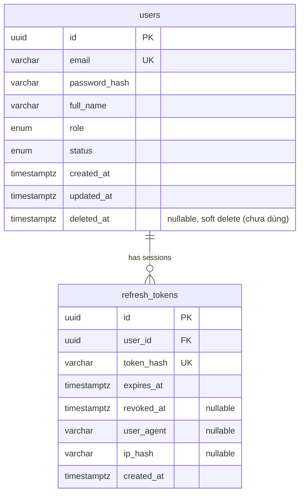
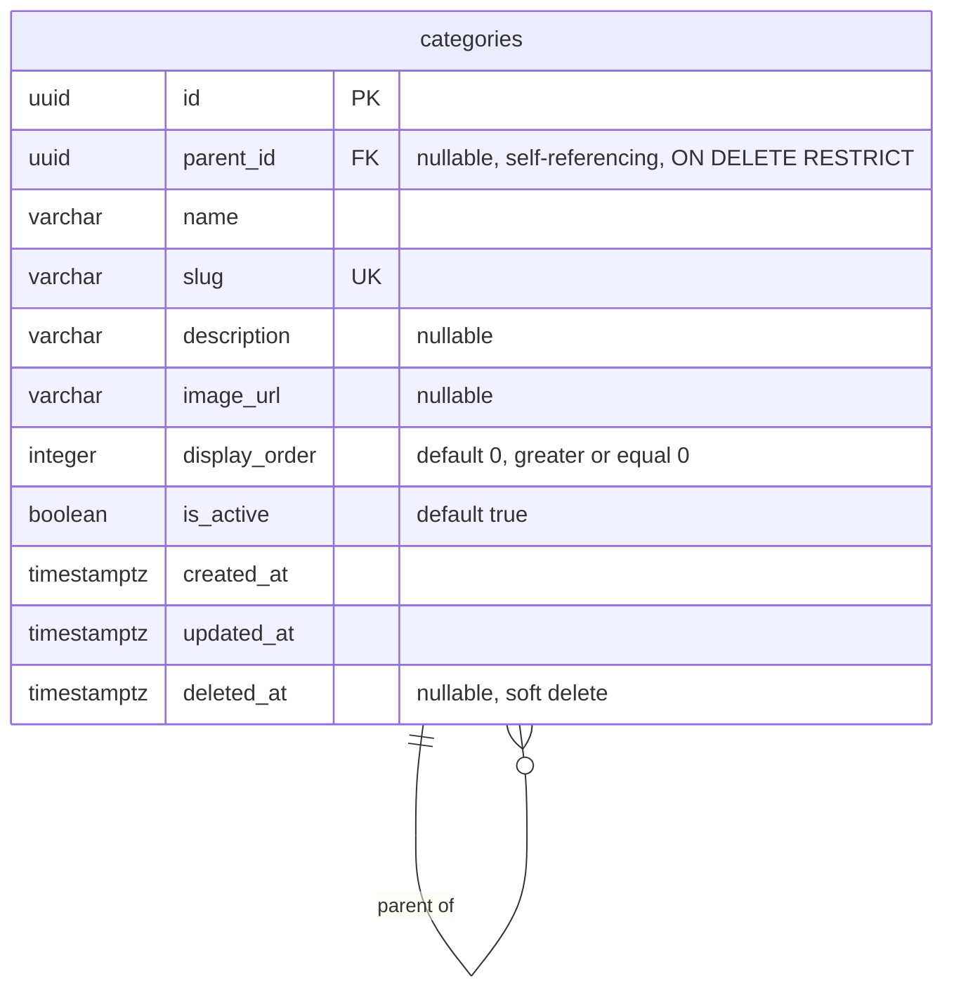
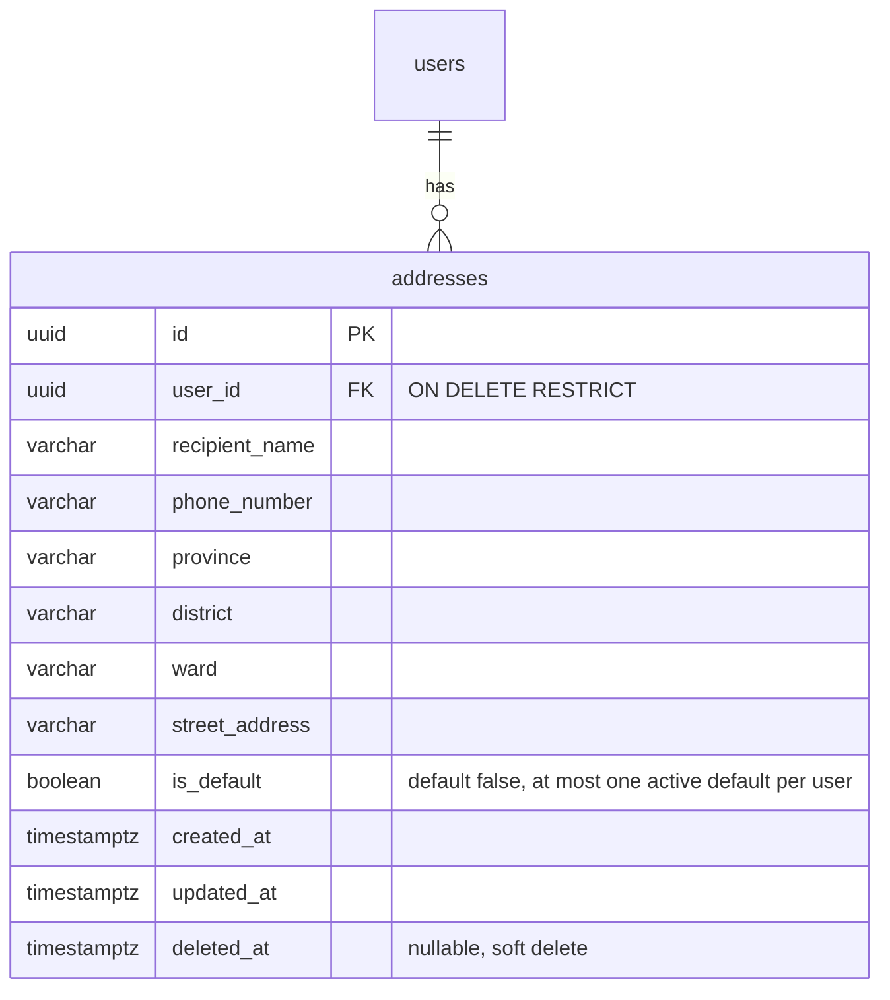

# Database Design — Core Entities (User, Auth, Category, Address)

Tài liệu này mô tả business requirements và thiết kế database thực tế của
các module **User**, **Auth** (`backend/src/modules/users`,
`backend/src/modules/auth`), **Category**
(`backend/src/modules/categories`) và **Address**
(`backend/src/modules/addresses`) trong backend. Nội dung được tái dựng từ
mã nguồn, migration và test hiện có — không phải từ giáo trình. Chỗ nào
không suy ra được từ code/test sẽ được ghi rõ là **chưa xác định**.

## 1. Phạm vi

Các phần đã triển khai và tài liệu hoá trong file này chịu trách nhiệm:

- Lưu trữ tài khoản người dùng (`users`).
- Xác thực bằng email/password (argon2) và cấp JWT access token.
- Quản lý refresh token dạng session xoay vòng (rotation) với phát hiện
  tái sử dụng (reuse detection), lưu ở bảng `refresh_tokens`.
- Tổ chức sản phẩm theo cây danh mục nhiều cấp (`categories`) — xem mục 14.
- Lưu địa chỉ giao hàng của người dùng (`addresses`) — xem mục 23.

Ngoài phạm vi (thuộc các bài/module khác, **chưa triển khai**, không đụng
tới ở đây): Brand, Product, ProductImage, ProductVariant, Inventory, Coupon,
Cart, Order, Payment, Shipment, Review, Search, Elasticsearch, Supabase
Storage, PayOS, CategoryTranslation, Locale.

## 2. Actor và quyền hạn

| Actor | Quyền hạn liên quan đến Auth |
| --- | --- |
| Khách vãng lai (chưa đăng nhập) | Gọi `POST /auth/register`, `POST /auth/login`, `POST /auth/refresh`, `POST /auth/logout` (các route đánh dấu `@Public()`) |
| `CUSTOMER` (mặc định sau khi đăng ký) | Gọi `GET /auth/me`; các route yêu cầu JWT hợp lệ |
| `ADMIN` | Giống `CUSTOMER` về Auth; phân quyền theo `role` cho các resource khác dùng `RolesGuard` + `@Roles()` (chưa có route nào dùng ở phạm vi Auth hiện tại) |

`UserRole` chỉ có hai giá trị: `CUSTOMER`, `ADMIN`
(`src/common/enums/user-role.enum.ts`). Tài khoản `ADMIN` **chỉ** được tạo
qua seed script (`pnpm seed:admin`, đọc `SEED_ADMIN_EMAIL/PASSWORD/FULL_NAME`
từ env) — endpoint đăng ký công khai (`POST /auth/register`) luôn gán cứng
`role: CUSTOMER` ở `AuthService.register()`, không nhận `role` từ body
request (`RegisterDto` không có trường `role`). Đây là invariant bắt buộc:
**role không bao giờ được nhận trực tiếp từ input đăng ký công khai**.

## 3. Luồng đăng ký (`POST /auth/register`)

1. `RegisterDto` validate `email` (định dạng email, tối đa 255 ký tự),
   `password` (8–128 ký tự), `fullName` (2–255 ký tự).
2. `AuthService.register()` chuẩn hoá email bằng `email.toLowerCase()`.
3. Kiểm tra tồn tại qua `UsersService.findByEmail(normalizedEmail)`. Nếu đã
   tồn tại → `409 Conflict` với `code: EMAIL_ALREADY_EXISTS`.
4. Hash password bằng `argon2.hash()` (argon2id, tham số mặc định của thư
   viện `argon2`). **Không bao giờ lưu password dạng plaintext.**
5. Tạo `UserEntity` với `role: CUSTOMER`, `status: ACTIVE` mặc định.
6. Response (`UserResponseDto`) chỉ trả `id, email, fullName, role, status`
   — không bao giờ trả `passwordHash`.

Rate limit: `@Throttle({ default: { limit: 5, ttl: 60_000 } })` (5 lần/phút
theo IP, qua `ThrottlerGuard` toàn cục + Redis storage).

## 4. Luồng đăng nhập (`POST /auth/login`)

1. `AuthService.validateCredentials(email, password)`:
   - Tìm user theo email đã lowercase.
   - Nếu không tồn tại: vẫn chạy `argon2.hash()` trên một chuỗi ngẫu nhiên
     (`simulatePasswordVerification`) trước khi trả `401 INVALID_CREDENTIALS`
     — chống timing attack dò email tồn tại hay không.
   - Nếu tồn tại nhưng sai password: `401 INVALID_CREDENTIALS` (thông điệp
     giống hệt trường hợp không tồn tại — không lộ email có tồn tại).
   - Nếu đúng password nhưng `status !== ACTIVE`: `403 ACCOUNT_NOT_ACTIVE`.
2. `AuthService.login()`: ký access token JWT (`signAccessToken`, secret
   `JWT_ACCESS_SECRET`, hạn `JWT_ACCESS_EXPIRES_IN`) và phát hành refresh
   token mới (`issueRefreshToken`).
3. Access token trả trong response body (`AuthResponseDto.accessToken`).
   Refresh token (raw, chưa hash) chỉ được đặt vào cookie `httpOnly`,
   `sameSite=lax`, `secure` theo `COOKIE_SECURE` — **không bao giờ xuất hiện
   trong response body**.

Rate limit: 10 lần/phút theo IP.

## 5. Vòng đời refresh session & rotation (`POST /auth/refresh`)

Mỗi lần đăng nhập/refresh thành công tạo **một session mới** (một dòng
`refresh_tokens`), không tái sử dụng dòng cũ:

1. Token thô (64 byte ngẫu nhiên từ `crypto.randomBytes`, hex-encode) chỉ
   tồn tại phía client (cookie). Server chỉ lưu
   `sha256(rawToken)` (`tokenHash`, cột `token_hash`, unique).
   **Không lưu refresh token thô trong database.**
2. `POST /auth/refresh` gọi `RefreshTokensRepository.rotate(tokenHash, newToken)`
   (`backend/src/modules/auth/refresh-tokens.repository.ts`), toàn bộ chạy
   trong **một transaction** (`repository.manager.transaction(...)`):
   - `SELECT ... FOR UPDATE` (`lock: { mode: 'pessimistic_write' }`) khoá
     đúng dòng `refresh_tokens` theo `token_hash`. Hai request đồng thời
     trình cùng một token thô sẽ tuần tự hoá trên chính dòng đó: request
     thứ hai bị **chặn (block)** ở bước `SELECT ... FOR UPDATE` cho đến khi
     transaction của request thứ nhất `COMMIT` hoặc `ROLLBACK`.
   - Không tìm thấy token → `{ kind: 'invalid' }`, trả `401`.
   - Token đã `revokedAt` (dù do rotate hợp lệ trước đó, hay do request kia
     vừa thắng cuộc đua và đã commit) → `{ kind: 'invalid' }`, trả `401`,
     **không** gọi `revokeAllForUser`. Xem mục "Race condition đã sửa" bên
     dưới để biết lý do đây là điểm khác biệt cốt lõi so với thiết kế cũ.
   - Token hết hạn nhưng chưa revoke → revoke toàn bộ session còn hoạt
     động của user (`revokeAllForUser`, cùng transaction), trả về
     `{ kind: 'expired' }` → `401`. Đây là nhánh không liên quan tới race
     condition (token thực sự đã hết hạn), giữ nguyên hành vi cũ.
   - User không còn `ACTIVE` → revoke session này, trả `{ kind: 'inactive_user' }`
     → `401`.
   - Hợp lệ: revoke session hiện tại **và** insert session mới trong cùng
     transaction, trả `{ kind: 'success', user }` → `200` với access token
     và refresh token mới.

### Race condition đã sửa

**Thiết kế cũ** (trước đợt audit này): đọc token, kiểm tra, sau đó
`UPDATE ... WHERE id = :id AND revoked_at IS NULL` có điều kiện, dùng
`UpdateResult.affected` để biết mình có "thắng" hay không; nếu thua
(`affected === 0`) thì gọi `revokeAllForUser(userId)` **ngoài mọi
lock/transaction**. Vấn đề: nếu request thua gọi `revokeAllForUser` *sau
khi* request thắng đã `INSERT` xong session mới, `revokeAllForUser` (một
`UPDATE ... WHERE user_id = X AND revoked_at IS NULL` không giới hạn theo
token) sẽ **vô tình thu hồi luôn session mới hợp lệ** vừa được request
thắng tạo ra — client "thắng" cuộc đua vẫn coi như bị đăng xuất ngay sau
đó. Bằng chứng: trước khi sửa, test đồng thời gửi 2 request refresh cùng
token có thể khiến **cả 2** cùng nhận `200` (không có bất kỳ khoá nào ép
buộc tuần tự các bước validate → revoke → insert), hoặc khiến response
`200` hợp lệ của request thắng bị vô hiệu hoá ngay sau đó bởi request thua.

**Thiết kế mới**: dùng `SELECT ... FOR UPDATE` để khoá đúng một dòng
`refresh_tokens`, toàn bộ validate + revoke + insert nằm trong **cùng một
transaction** giữ khoá đó đến khi commit. Request thứ hai chỉ có thể đọc
lại dòng này **sau khi** request thứ nhất đã commit — tại thời điểm đó nó
chắc chắn thấy `revoked_at` đã được set, và phản hồi đơn giản là "invalid"
mà **không đụng đến bất kỳ dòng nào khác** (không có `revokeAllForUser`
tràn lan trong nhánh này). Điều này loại bỏ hoàn toàn khả năng request
thua ghi đè lên session hợp lệ mà request thắng vừa tạo.

Kiểm chứng bằng test đồng thời thật (không phải tuần tự giả lập):
- `backend/test/auth.e2e-spec.ts` — `allows only one winner when the same
  refresh token is used concurrently, and the winner new token survives
  untouched`: gửi 2 request `POST /auth/refresh` song song
  (`Promise.all`) cùng một cookie, xác nhận đúng 1 request `200`, 1 request
  `401`; sau đó dùng cookie mới của request thắng — xác nhận nó **vẫn còn
  hoạt động** (đúng một lần), rồi dùng lại nó lần nữa thì bị từ chối (reuse
  detection vẫn hoạt động cho thế hệ token kế tiếp).
- `allows three-way concurrent refresh with the same token to still yield
  exactly one winner`: 3 request song song, xác nhận đúng 1 `200` và 2
  `401`.
- Xác minh thủ công bổ sung: 2 tiến trình `curl` chạy song song thật sự ở
  cấp hệ điều hành (không phải trong cùng process Node/Jest) nhắm vào
  server `pnpm start:dev` đang chạy thật — kết quả giống hệt test tự động
  (đúng 1 `200`, token mới dùng được đúng 1 lần, logout vẫn hoạt động sau
  đó).

**Không thay đổi**: HTTP status, `code: INVALID_REFRESH_TOKEN`, cấu trúc
response, cookie, hay bất kỳ route nào. Đây thuần tuý là thay đổi cơ chế
nội bộ của tầng repository.

**Giới hạn còn lại**: `SELECT ... FOR UPDATE` chỉ khoá dòng của token
*đang được trình ra*. Nó không tạo ra deadlock (chỉ một dòng, một loại
khoá, không có chu trình chờ chéo) và không cần isolation level cao hơn
mặc định (`READ COMMITTED`) vì tính đúng đắn ở đây đến từ khoá dòng tường
minh, không phải từ isolation level. Cơ chế phát hiện chu trình reuse dài
hạn (token cũ bị dùng lại sau một khoảng thời gian dài, không liên quan
race condition) không thuộc phạm vi sửa lỗi lần này — xem mục "Lỗ hổng còn
lại" trong báo cáo audit tương ứng.

## 6. Đăng xuất (`POST /auth/logout`)

Lấy refresh token thô từ cookie, hash, tìm session, revoke nếu còn active
(idempotent — gọi nhiều lần không lỗi). Luôn xoá cookie phía client dù có
token hay không.

**Đăng xuất "tất cả thiết bị" hiện tại là một hệ quả của reuse detection**
(`revokeAllForUser` được gọi tự động khi phát hiện refresh token bị dùng
lại), **không phải một endpoint công khai riêng** (không có
`POST /auth/logout-all` hay tương đương). Nếu có yêu cầu nghiệp vụ cho
người dùng chủ động "đăng xuất mọi thiết bị" từ một thiết bị đang đăng
nhập, đây là **tính năng chưa xác định/chưa triển khai** — không suy ra
được từ code hay test hiện tại.

## 7. Quy tắc khoá/vô hiệu hoá tài khoản

`UserStatus`: `ACTIVE`, `INACTIVE`, `BLOCKED`
(`src/common/enums/user-status.enum.ts`). Không có API nào trong phạm vi
Auth hiện tại để đổi status (chưa có endpoint admin quản lý user) — đây là
**chưa triển khai**, có thể thuộc phạm vi module Users/Admin sau này.

Khi user không còn `ACTIVE`:

- Đăng nhập bị chặn ngay ở bước `validateCredentials` (`403`).
- `JwtStrategy.validate()` chặn luôn access token của user không còn
  `ACTIVE` (kiểm tra lại DB mỗi request, không chỉ tin JWT payload).
- `AuthService.refresh()` chặn và revoke session nếu user không còn
  `ACTIVE`.

Không có cơ chế xoá cứng (`hard delete`) user trong code hiện tại.
`UserEntity` có `@DeleteDateColumn` (soft delete) nhưng **chưa có API nào
gọi `softRemove`/`softDelete`** — cột `deleted_at` tồn tại ở schema nhưng
chưa được nghiệp vụ nào sử dụng. Vì `refresh_tokens.user_id` có
`ON DELETE CASCADE`, nếu user bị xoá cứng thì toàn bộ refresh token của
user đó bị xoá theo — không tạo orphan session. Vì soft delete không xoá
dòng, nó **không** tự động vô hiệu hoá refresh token đang có; đây là điểm
cần lưu ý nếu sau này có tính năng "xoá tài khoản" dùng soft delete
(xem mục 11).

## 8. Quy tắc unique email & chuẩn hoá

- Cột `users.email` có unique constraint (`UQ_users_email`, tạo bằng
  `CREATE UNIQUE INDEX` trong migration; entity khai báo
  `@Column({ unique: true })` + `@Index({ unique: true })`).
- Chuẩn hoá email **nhất quán ở application layer** bằng `.toLowerCase()`
  tại **mọi** điểm ghi/đọc: `AuthService.register()`,
  `AuthService.validateCredentials()`, `UsersService.createUser()`,
  `UsersRepository.findByEmail()`, và seed script (`admin.seed.ts`).
  → Không thể tạo hai tài khoản khác nhau chỉ vì khác chữ hoa/thường, miễn
  mọi đường ghi dữ liệu đều đi qua các lớp trên (không có đường ghi trực
  tiếp nào bỏ qua bước lowercase).
- **Quyết định thiết kế:** không dùng `citext` hay unique index theo
  `lower(email)` ở tầng database, vì việc chuẩn hoá ở application layer đã
  nhất quán và đủ để đảm bảo bất biến — thêm một cơ chế case-insensitive
  thứ hai ở tầng DB sẽ trùng trách nhiệm mà không có lợi ích rõ ràng.

## 9. Dữ liệu nhạy cảm & cách bảo vệ

| Dữ liệu | Lưu trữ | Expose qua API? | Log? |
| --- | --- | --- | --- |
| Password | `users.password_hash` (argon2 hash) | Không (không có trường `password`/`passwordHash` trong bất kỳ response DTO nào) | Không (Pino redact `password`, `passwordHash`, ...) |
| Refresh token | `refresh_tokens.token_hash` (sha256 hex) | Chỉ raw token trong cookie `httpOnly`, không có trong JSON body | Không (Pino redact `token`, `refreshToken`, ...) |
| JWT secrets | biến môi trường `JWT_ACCESS_SECRET`/`JWT_REFRESH_SECRET` | Không | Không (Pino redact tên biến) |

## 10. Quan hệ giữa các bảng



`refresh_tokens.user_id → users.id`, `ON DELETE CASCADE` (xoá user thì xoá
theo toàn bộ session của user đó, tránh orphan row).

## 11. Index và constraint — lý do chọn

| Bảng | Index/constraint | Lý do |
| --- | --- | --- |
| `users` | `PK_users_id` (uuid) | Khoá chính, dùng làm FK cho `refresh_tokens` và các module tương lai (Order, Review, ...) |
| `users` | `UQ_users_email` (unique index trên `email`) | Bắt buộc email duy nhất; cũng là index chính cho tra cứu đăng nhập (`WHERE email = ...`) |
| `refresh_tokens` | `PK_refresh_tokens_id` (uuid) | Khoá chính |
| `refresh_tokens` | `UQ_refresh_tokens_token_hash` (unique index trên `token_hash`) | Bắt buộc không trùng hash (thực tế xác suất trùng ~0 vì sinh ngẫu nhiên 64 byte); đồng thời là index phục vụ tra cứu mỗi lần refresh/logout (`WHERE token_hash = ...`) — đường truy vấn nóng nhất của bảng này |
| `refresh_tokens` | `IDX_refresh_tokens_user_id` (index trên `user_id`) | Phục vụ `revokeAllForUser` (`WHERE user_id = ... AND revoked_at IS NULL`) và các truy vấn liệt kê session theo user trong tương lai |
| `refresh_tokens` | `FK_refresh_tokens_user_id` (`ON DELETE CASCADE`) | Không cho phép session tồn tại mà không có user (tránh orphan); cascade để không cần dọn thủ công khi xoá user |

**Chưa cần thêm** (không có bằng chứng nhu cầu truy vấn cụ thể ở quy mô
hiện tại, tránh over-index): partial index `WHERE revoked_at IS NULL` trên
`refresh_tokens`, index trên `users.status`/`users.role`.

## 12. Transaction & concurrency

| Thao tác | Có transaction rõ ràng? | Ghi chú |
| --- | --- | --- |
| Đăng ký user | Không (một câu INSERT) | Đơn thao tác, không cần transaction |
| Tạo refresh session (login) | Không (một câu INSERT) | Đơn thao tác |
| Rotate refresh token | Không dùng transaction, nhưng **nguyên tử nhờ UPDATE có điều kiện** (`revoked_at IS NULL`) + kiểm tra `affected` | Xem mục 5; đủ để loại bỏ race chính (double-rotate) mà không cần transaction/khoá tường minh |
| Phát hiện reuse | `revokeAllForUser` là một UPDATE hàng loạt, tự nguyên tử ở mức statement | — |
| Revoke một session (logout) | Không cần | Idempotent theo thiết kế |
| Revoke toàn bộ session của user | Không cần transaction | Một UPDATE hàng loạt |

Không có thao tác nào giữ transaction mở trong lúc gọi email/Redis/HTTP.
Không cần isolation level cao hơn `READ COMMITTED` mặc định của PostgreSQL
cho các luồng trên.

## 13. Quy trình thêm/thay đổi schema bằng migration

1. Sửa entity trong `src/modules/*/entities/*.entity.ts`.
2. **Không** dùng `synchronize: true` ở bất kỳ môi trường nào (kể cả test).
3. Tạo migration mới (không sửa migration cũ đã có khả năng chạy ở môi
   trường khác):
   ```bash
   cd backend
   pnpm migration:generate src/database/migrations/TenMigration
   # hoặc viết tay:
   pnpm migration:create src/database/migrations/TenMigration
   ```
4. Migration phải có `up`/`down` hợp lệ, đặt tên constraint/index rõ ràng,
   backfill dữ liệu trước khi đổi cột sang `NOT NULL`, không xoá dữ liệu
   người dùng hiện có.
5. Chạy `pnpm migration:run` trên database test/staging trước khi áp dụng
   production.
6. CLI (`src/database/data-source.ts`) và runtime
   (`src/database/database.module.ts`) dùng chung
   `createPostgresConnectionOptions()` (`src/database/database.config.ts`)
   để đảm bảo cùng một cấu hình kết nối/pool/naming strategy.

## 14. Category — business requirements

Category tổ chức sản phẩm theo cấu trúc cây nhiều cấp (self-referencing
adjacency list qua `parent_id`). Yêu cầu nghiệp vụ đã xác nhận:

- Một Category có thể là gốc (không `parent`) hoặc con (đúng một `parent`).
- Một Category có thể có nhiều Category con; cây có thể có nhiều cấp,
  **không giới hạn độ sâu** (chưa có business requirement nào giới hạn).
- Category có `slug` duy nhất dùng cho URL, `displayOrder` để admin sắp xếp
  thủ công, `isActive` để ẩn/hiện, `name` bắt buộc, `description` và
  `imageUrl` tuỳ chọn.
- Category dùng soft delete (`deletedAt`).
- Một Product (chưa triển khai) sẽ thuộc một Category trong tương lai.

Actor & quyền hạn dự kiến cho CRUD Category trong tương lai (**chưa triển
khai trong lượt này**, chỉ ghi nhận để CRUD sau này bám theo):

- Chỉ `ADMIN` được tạo, sửa, sắp xếp, ẩn/hiện và xóa Category.
- Người dùng công khai chỉ đọc Category `isActive=true` và chưa bị xóa mềm.

## 15. Thiết kế cây Category (adjacency list)

**Quyết định:** dùng adjacency list (`parent_id` tự tham chiếu), **không**
dùng nested set (left/right), materialized path, hay closure table. Lý do:
các mô hình đó tối ưu cho truy vấn "lấy toàn bộ cây con" trên cây lớn với
chi phí ghi cao hơn (nested set phải cập nhật hàng loạt dòng khi
insert/move); ở quy mô Category của một cửa hàng thương mại điện tử (nhiều
nhất vài trăm-vài nghìn danh mục), adjacency list cộng truy vấn đệ quy khi
cần là đủ và đơn giản hơn để duy trì đúng. Sẽ cân nhắc lại nếu có bằng
chứng truy vấn cây quy mô lớn thực sự cần tối ưu hơn.

Quan hệ:

- `CategoryEntity.parent` - ManyToOne tới chính `CategoryEntity`,
  nullable, `onDelete: RESTRICT`, không eager, không cascade.
- `CategoryEntity.children` - OneToMany ngược lại, không eager, không
  cascade.
- Category gốc: `parent_id IS NULL`.
- **ON DELETE RESTRICT**: hard-delete một Category còn con sẽ bị PostgreSQL
  từ chối (lỗi FK violation) thay vì âm thầm xóa cascade toàn cây hoặc tự
  động biến con thành gốc. Đã kiểm chứng bằng test
  "blocks hard-deleting a parent category that still has children"
  (`backend/test/category-schema.e2e-spec.ts`).
- **Check constraint chống tự làm cha** (`CHK_categories_parent_not_self`):
  `parent_id IS NULL OR parent_id <> id`. Đã kiểm chứng bằng test thực trên
  PostgreSQL ("rejects a category being its own parent").
- **Giới hạn đã biết của check constraint này**: nó chỉ chặn được trường
  hợp một Category trực tiếp làm cha của chính nó (độ sâu 1). Nó không phát
  hiện được chu trình nhiều cấp kiểu A tới B tới C tới A. Việc phát hiện
  chu trình nhiều cấp là trách nhiệm của Category service trong tương lai,
  phải chạy trong transaction khi cho phép đổi `parentId` của một Category
  đã tồn tại. **Bài 23 chưa triển khai CRUD/service nên invariant chống
  chu trình nhiều cấp CHƯA được coi là hoàn thành** - chỉ mới có check
  constraint chống tự-làm-cha ở độ sâu 1.

## 16. Slug

- `slug` bắt buộc (NOT NULL), kiểu `varchar(255)`, không dùng kiểu số.
- Unique **toàn bộ bảng, kể cả Category đã soft delete** — không dùng
  partial unique index kiểu `WHERE deleted_at IS NULL`. Lý do: tránh một
  URL/slug cũ vô tình trỏ sang Category mới sau khi Category cũ bị xóa
  mềm, và tránh mơ hồ khi khôi phục Category đã xóa. Đã kiểm chứng bằng
  test `soft delete keeps the row in the database and reserves its slug`
  và `does not allow reusing a soft-deleted slug even with different
  casing`.
- **Unique không phân biệt hoa/thường (đã sửa).** Thiết kế ban đầu dùng
  unique constraint case-sensitive thông thường (`UQ_categories_slug`),
  được xác minh trực tiếp trên PostgreSQL là **cho phép `dien-tu` và
  `Dien-Tu` cùng tồn tại** — vì Category chưa có CRUD/service nào chuẩn
  hóa slug trước khi ghi, database không thể dựa vào "service tương lai
  sẽ lowercase" để đảm bảo tính duy nhất của URL. Migration
  `CategorySlugCaseInsensitiveUnique1738300000000` thay
  `UQ_categories_slug` (unique constraint trên `slug`) bằng
  `UQ_categories_slug_lower` — **unique index trên `lower(slug)`** — giữ
  nguyên quyết định "global unique kể cả sau soft delete" (không thêm
  `WHERE deleted_at IS NULL`).
- Chỉ một cơ chế duy nhất đảm bảo unique: functional unique index
  `lower(slug)` ở tầng database. Không dùng đồng thời `citext` (tránh
  thêm phụ thuộc kiểu dữ liệu mới khi một unique index thường đã đủ), và
  không dựa vào chuẩn hóa application layer làm cơ chế duy nhất (vì chưa
  có service nào tồn tại để làm việc đó) — tránh nhiều cơ chế trùng trách
  nhiệm.
- `CategoryEntity.slug` không còn khai báo `unique: true` ở cấp cột (điều
  đó chỉ tạo được unique case-sensitive); index case-insensitive được khai
  báo với `synchronize: false` thuần làm tài liệu, vì TypeORM không thể
  biểu diễn index trên biểu thức `lower(slug)` qua decorator — xem chú
  thích trong `category.entity.ts` và mục "Kiểm tra schema drift" bên
  dưới.
- Đã kiểm chứng trực tiếp trên PostgreSQL (không chỉ dựa vào migration
  chạy thành công):
  ```sql
  INSERT INTO categories (name, slug) VALUES ('Điện tử', 'dien-tu-verify');
  INSERT INTO categories (name, slug) VALUES ('Điện tử 2', 'Dien-Tu-Verify');
  -- ERROR: duplicate key value violates unique constraint "UQ_categories_slug_lower"
  ```
- Chuẩn hóa/trim slug ở application layer **vẫn chưa được triển khai**
  trong lượt này vì chưa có Category service/CRUD — đây là trách nhiệm
  của CRUD tương lai, không phải của migration này. Migration này chỉ đảm
  bảo database từ chối trùng lặp không phân biệt hoa/thường ngay cả khi
  không có service nào chuẩn hóa input.

## 17. displayOrder và isActive

- `display_order integer NOT NULL DEFAULT 0`, có check
  `CHK_categories_display_order_non_negative` (`display_order >= 0`).
  Không phải định danh, không yêu cầu duy nhất - nhiều Category cùng cấp có
  thể cùng `displayOrder` (sắp xếp ổn định theo `createdAt`/`id` là trách
  nhiệm của application layer tương lai, chưa triển khai).
- `is_active boolean NOT NULL DEFAULT true`. `isActive=false` nghĩa là tạm
  ẩn, không phải đã xóa. `deletedAt` mới là đã xóa mềm.
- Quy tắc hiển thị công khai dự kiến (application layer tương lai, chưa
  được database đảm bảo): một Category chỉ hiển thị công khai khi bản thân
  nó `isActive=true`, chưa `deletedAt`, và toàn bộ tổ tiên của nó cũng
  `isActive=true` và chưa bị xóa mềm. Việc kiểm tra toàn bộ chuỗi tổ tiên
  là trách nhiệm tương lai; tắt Category cha không tự động cập nhật
  `isActive` của Category con (không có trigger hay cascade nào làm việc
  này ở lượt này).

## 18. Soft delete

- `deleted_at timestamptz NULL`, dùng `@DeleteDateColumn` - cùng convention
  với `UserEntity`.
- Soft delete không phải cascade toàn cây: xóa mềm một Category cha không
  tự động xóa mềm Category con (TypeORM softDelete/softRemove không
  cascade trừ khi khai báo cascade trên relation - relation ở đây không
  khai báo cascade).
- Quy tắc "khi xóa Category cha còn con thì phải làm gì" (chặn / xóa mềm cả
  cây / chuyển con sang gốc / chuyển con sang Category khác) chưa được xác
  định rõ. Đề xuất an toàn cho CRUD tương lai: chặn xóa (kể cả soft delete)
  khi còn Category con đang hoạt động hoặc còn Product đang dùng, trừ khi
  admin thực hiện thao tác tái cấu trúc rõ ràng (ví dụ chuyển con sang
  Category khác trước). Đây chỉ là đề xuất cho application layer tương lai
  - Bài 23 không triển khai service nên không có gì thực thi quy tắc này ở
  hiện tại; database chỉ đảm bảo ON DELETE RESTRICT cho hard delete.
- Hard delete chỉ nên dùng cho: rollback migration, dữ liệu test cô lập,
  hoặc thao tác quản trị đặc biệt đã kiểm soát - không phải luồng nghiệp vụ
  thông thường.

## 19. Index và constraint - Category

| Constraint/Index | Loại | Lý do |
| --- | --- | --- |
| `PK_categories_id` | Primary key (uuid) | Khoá chính |
| `UQ_categories_slug` | Unique constraint | Slug duy nhất toàn bảng (mục 16) |
| `FK_categories_parent_id` | Self foreign key, ON DELETE RESTRICT | Chặn hard-delete cha còn con (mục 15) |
| `CHK_categories_parent_not_self` | Check | Chặn tự làm cha ở độ sâu 1 (mục 15) |
| `CHK_categories_display_order_non_negative` | Check | `display_order >= 0` |
| `IDX_categories_parent_id_display_order` | Composite index (parent_id, display_order) | Phục vụ truy vấn "liệt kê Category con của một cha, sắp theo displayOrder" - query cây phổ biến nhất; đồng thời đóng vai trò index cho riêng parent_id (prefix trái), nên không tạo thêm index đơn parent_id để tránh trùng prefix |

**Không thêm** (chưa có bằng chứng nhu cầu truy vấn): index riêng trên
`is_active` (selectivity thấp - chỉ 2 giá trị), index trên `name`.

## 20. Quan hệ Product tương lai

Workbook xác nhận: một Category có nhiều Product, một Product thuộc một
Category. **`ProductEntity` chưa tồn tại trong repository** - do đó
`CategoryEntity` không khai báo relation tới Product, không có cột
`product_id`, không tạo bảng `products`, và không thêm cột đếm
`productCount` (số lượng Product nên tính bằng query/projection khi Product
tồn tại, không lưu denormalized). Khi Product được triển khai,
`ProductEntity` sẽ có `categoryId`/`category` trỏ về `CategoryEntity` hiện
tại - không cần đổi gì ở phía Category.

## 21. Đa ngôn ngữ tương lai (category_translations)

Trong lượt này, `name` và `description` vẫn nằm trực tiếp trên bảng
`categories`, đóng vai trò dữ liệu ngôn ngữ mặc định. Không tạo bảng
`locales` hay `category_translations`, không thêm `localeId`, không thêm
cột `nameVi`/`nameEn`.

Chiến lược i18n tương lai (chỉ ghi nhận, chưa triển khai):

- Tạo bảng `locales` và `category_translations` (mỗi Category có tối đa
  một bản dịch cho mỗi locale).
- `slug`, `imageUrl`, `parentId`, `isActive`, `displayOrder` vẫn thuộc bảng
  `categories` - đây là thuộc tính không phụ thuộc ngôn ngữ, không di
  chuyển sang bảng dịch.
- Migration i18n tương lai phải backfill `name`/`description` hiện tại
  thành bản dịch mặc định (ví dụ locale vi) cho mọi Category đang có,
  không được để mất dữ liệu.
- Ứng dụng cần cơ chế fallback về locale mặc định khi thiếu bản dịch cho
  một locale được yêu cầu.

## 22. Sơ đồ ER - Category (hiện trạng thật)



Sơ đồ này chỉ thể hiện self-relation của `categories` - không có bảng
`products`, `locales`, hay `category_translations` vì các bảng đó chưa tồn
tại trong repository.

## 23. Kiểm tra schema drift (`schema:log`)

`migration:show` chỉ xác nhận migration đã chạy hay chưa, **không** xác
nhận entity metadata khớp với schema thật. Lượt audit này chạy thêm
`pnpm typeorm schema:log` (so sánh entity metadata với schema PostgreSQL
thật) trên database test đã migrate đầy đủ.

**Phát hiện ban đầu**: `SnakeCaseNamingStrategy`
(`src/database/naming-strategy.ts`) chỉ override `tableName`,
`columnName`, `relationName`, `joinColumnName`, `joinTableName`,
`joinTableColumnName` — **không** override `foreignKeyName`,
`uniqueConstraintName`, `indexName`. Với các cột/relation không được đặt
tên tường minh trong entity (`@Column({ unique: true })` không kèm tên,
`@Index()` không tham số, `@ManyToOne` không có cách đặt tên FK qua
decorator), TypeORM tự sinh tên dạng hash (`FK_<hash>`, `UQ_<hash>`,
`IDX_<hash>`) — không khớp với tên tường minh mà mọi migration trong dự
án này luôn đặt (`FK_<table>_<col>`, `UQ_<table>_<col>`,
`IDX_<table>_<col>`). `schema:log` ban đầu báo muốn `DROP`/`ADD` lại toàn
bộ FK của `refresh_tokens`, `addresses`, `categories`, và index/unique
của `refresh_tokens.user_id`, `addresses.user_id` chỉ để đổi tên.

**Đã sửa (thuộc phạm vi Address/Category)**: thêm `foreignKeyName`,
`uniqueConstraintName`, `indexName` vào `SnakeCaseNamingStrategy`, sinh
đúng quy ước `<PREFIX>_<table>_<col1>_<col2>` đã dùng trong mọi migration.
**Không cần migration mới** cho thay đổi này — không có schema vật lý nào
đổi, chỉ có cách TypeORM *dự đoán tên* để so sánh là thay đổi, để khớp với
tên đã tồn tại thật trong database. Index/constraint được đặt tên tường
minh qua decorator (`UQ_categories_slug_lower`,
`IDX_categories_parent_id_display_order`,
`UQ_addresses_user_default_active`, các `@Check()` có tên) không đi qua
naming strategy nên không bị ảnh hưởng.

**Còn lại sau khi sửa (đã xác nhận bằng `schema:log`, KHÔNG thuộc phạm vi
Address/Category, không sửa trong lượt này)**: `UserEntity.email` và
`RefreshTokenEntity.tokenHash` mỗi cột có **cả hai** decorator
`@Index({ unique: true })` và `@Column({ unique: true })`. Cột-level
`unique: true` đi qua `uniqueConstraintName()` (nay khớp đúng
`UQ_users_email`/`UQ_refresh_tokens_token_hash`), nhưng decorator
`@Index({ unique: true })` không tên đi qua `indexName()` (nay sinh
`IDX_users_email`/`IDX_refresh_tokens_token_hash`) — hai metadata cho
cùng một cột, chỉ có MỘT index tồn tại thật trong DB. Đây là kiểu khai báo
kép đã có từ trước (thuộc Auth, tạo ở lượt audit trước), không phải do
thay đổi trong lượt này. `schema:log` sau khi sửa naming strategy còn lại
đúng 6 câu lệnh, toàn bộ liên quan tới 2 cột này — **không còn** câu lệnh
nào liên quan `addresses` hay `categories`. Không sửa trong lượt này vì
nằm ngoài phạm vi khai báo (chỉ Address/Category); ghi nhận là lỗ hổng đã
biết, chưa xử lý.

Kết quả `schema:log` cuối cùng đã kiểm chứng (database test cô lập, sau
khi fresh-migrate và sau khi revert+migrate lại migration Address và
Category):

```
DROP INDEX "public"."UQ_refresh_tokens_token_hash";
DROP INDEX "public"."UQ_users_email";
ALTER TABLE "refresh_tokens" ADD CONSTRAINT "UQ_refresh_tokens_token_hash" UNIQUE ("token_hash");
ALTER TABLE "users" ADD CONSTRAINT "UQ_users_email" UNIQUE ("email");
CREATE UNIQUE INDEX "IDX_refresh_tokens_token_hash" ON "refresh_tokens" ("token_hash");
CREATE UNIQUE INDEX "IDX_users_email" ON "users" ("email");
```

## 24. Address — business requirements

Mỗi User có thể lưu nhiều địa chỉ giao hàng; đúng một địa chỉ trong số đó
có thể được đánh dấu mặc định tại một thời điểm. Yêu cầu đã xác nhận (từ
prompt triển khai, ưu tiên cao hơn workbook nếu có khác biệt):

- Một User có thể có nhiều Address; mỗi Address thuộc đúng một User.
- Address có tên người nhận, số điện thoại, tỉnh/thành, quận/huyện,
  phường/xã, địa chỉ chi tiết (số nhà/đường) — hỗ trợ Unicode tiếng Việt.
- `isDefault` mặc định `false`; **tối đa một** Address đang hoạt động
  (chưa soft-delete) của mỗi User được phép là mặc định.
- Address dùng soft delete (`deletedAt`).

**Chưa thuộc phạm vi lượt này** (chỉ database foundation, không CRUD):

- Address Controller/Service/DTO — không tồn tại, không tạo trong lượt này.
- Transaction "đổi địa chỉ mặc định" (revoke địa chỉ mặc định cũ + set địa
  chỉ mới trong 1 transaction) — chưa có service nào để cần transaction
  này; sẽ cần khi CRUD được xây dựng, do phải đảm bảo tại mọi thời điểm
  giữa hai lệnh UPDATE không có trạng thái "0 hoặc 2 địa chỉ mặc định"
  thoáng qua (constraint DB chỉ chặn *kết quả cuối cùng* vi phạm, không
  ngăn được race giữa hai request đổi mặc định đồng thời cho cùng user —
  nếu cần, phải dùng `SELECT ... FOR UPDATE` trên các dòng address của
  user đó, tương tự cách đã sửa cho refresh token rotation).
- Authorization ownership (chỉ chính User đó hoặc Admin được sửa/xóa
  Address của mình) — chưa có API nên chưa có gì để authorize.

## 25. Thiết kế bảng Address

| Cột | Kiểu dữ liệu | Nullable | Default | Constraint | Ý nghĩa |
| --- | --- | --- | --- | --- | --- |
| `id` | uuid | NOT NULL | `gen_random_uuid()` | PK `PK_addresses_id` | Khoá chính, cùng chiến lược UUID với `users` |
| `user_id` | uuid | NOT NULL | — | FK `FK_addresses_user_id` (`ON DELETE RESTRICT`) | User sở hữu địa chỉ |
| `recipient_name` | varchar(255) | NOT NULL | — | — | Tên người nhận |
| `phone_number` | varchar(20) | NOT NULL | — | — | Số điện thoại liên hệ |
| `province` | varchar(255) | NOT NULL | — | — | Tỉnh/Thành phố |
| `district` | varchar(255) | NOT NULL | — | — | Quận/Huyện |
| `ward` | varchar(255) | NOT NULL | — | — | Phường/Xã |
| `street_address` | varchar(255) | NOT NULL | — | — | Số nhà, tên đường, chi tiết còn lại |
| `is_default` | boolean | NOT NULL | `false` | Ràng buộc bởi partial unique index (xem dưới) | Địa chỉ mặc định |
| `created_at` | timestamptz | NOT NULL | `now()` | — | Thời điểm tạo |
| `updated_at` | timestamptz | NOT NULL | `now()` | — | Thời điểm cập nhật |
| `deleted_at` | timestamptz | NULL | — | — | Soft delete |

Index: `IDX_addresses_user_id` (liệt kê địa chỉ theo user),
`UQ_addresses_user_default_active` (partial unique, xem mục 26).

## 26. Foreign key và partial unique index

- **`FK_addresses_user_id`: `ON DELETE RESTRICT`** (khác với
  `refresh_tokens.user_id` dùng `ON DELETE CASCADE`). Lý do khác nhau giữa
  hai bảng cùng tham chiếu `users`: refresh token là artifact bảo mật tạm
  thời, không còn giá trị độc lập một khi user không còn tồn tại, nên
  cascade là hợp lý; địa chỉ giao hàng có thể còn giá trị tham chiếu lịch
  sử (ví dụ Order trong tương lai), và User trong hệ thống này **chỉ**
  từng bị soft-delete (không có API hard-delete User nào tồn tại) — dùng
  `RESTRICT` là lựa chọn an toàn, tránh việc một hard-delete User (nếu
  sau này được thêm) âm thầm xóa sạch lịch sử địa chỉ mà không có quyết
  định nghiệp vụ rõ ràng.
- **`UQ_addresses_user_default_active`**: partial unique index
  `ON addresses (user_id) WHERE is_default = true AND deleted_at IS NULL`.
  Đảm bảo **tại tầng database**: mỗi user tại một thời điểm có tối đa một
  Address đang hoạt động (chưa xóa mềm) được đánh dấu mặc định. Dùng
  partial index thay vì unique constraint thường trên `user_id` vì một
  user **phải** được phép có nhiều Address không mặc định — yêu cầu này
  được nêu rõ trong đề bài. Soft-delete Address mặc định hiện tại sẽ giải
  phóng "chỗ trống" để tạo Address mặc định mới (đã kiểm chứng bằng test
  `allows a new default address after the old default is soft-deleted`).
- Quan hệ `AddressEntity.user` không `eager`, không `cascade` — không tải
  kèm User khi query Address, và ngược lại `UserEntity.addresses` (`OneToMany`)
  cũng không `eager`, không `cascade` — địa chỉ không tự động xuất hiện
  khi query User.

## 27. Invariant đã kiểm chứng trên PostgreSQL thật

Toàn bộ chạy trên database test cô lập
(`backend/test/address-schema.e2e-spec.ts`), không dùng SQLite hay mock:

| Invariant | Kết quả |
| --- | --- |
| Một User có nhiều Address | Xác nhận |
| Nhiều Address không mặc định cho cùng User | Xác nhận |
| Một Address mặc định cho một User | Xác nhận |
| Không thể có 2 Address mặc định đang hoạt động cho cùng User | Xác nhận — insert thứ hai bị partial unique index từ chối |
| Hai User khác nhau đều có thể có Address mặc định riêng | Xác nhận |
| Soft-delete Address mặc định cũ → tạo được Address mặc định mới | Xác nhận |
| `user_id` không tồn tại bị từ chối | Xác nhận — vi phạm FK |
| Soft delete không xóa vật lý | Xác nhận — dòng còn trong DB, `deleted_at` khác null |
| Unicode tiếng Việt lưu/đọc đúng | Xác nhận |
| `isDefault` mặc định `false` | Xác nhận |

## 28. Sơ đồ ER — Address (hiện trạng thật)



Sơ đồ này chỉ thể hiện quan hệ `users` – `addresses`; không có `orders`
hay bất kỳ bảng nào khác vì chúng chưa tồn tại trong repository.
